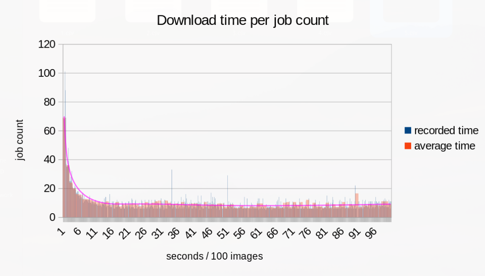

# EveryGarf - Comic Downloader

Concurrently download every Garfield comic to date.

## Stats

- Download size: 4.9GB
- Download time: ~20m[*](#download-time)
- Images: >16,400

# Installation

## Binary

[Download latest release](https://github.com/dxrcy/everygarf/releases/latest) (executable)

## Cargo (from source)

Install from [Crates.io](https://crates.io/crates/everygarf) with [Cargo](https://doc.rust-lang.org/cargo/getting-started/installation.html).

```sh
cargo install everygarf
```

Or clone repository, and install with `cargo`.

```sh
git clone https://github.com/dxrcy/everygarf
cargo install --path everygarf
```

# Usage

```sh
# Help information
everygarf --help

# Download to default folder ('garfield' in user pictures directory)
everygarf

# Change some options
everygarf ~/Pictures/garfield --remove-all --format png --notify-on-fail --attempts 20 --timeout 30 --jobs 40 --max 300 --tree

# Check if any images are missing
everygarf --query && echo 'Up to date!'
```

# About

## Download time

Download time was tested a few times (since v2.0), with varying values for `--jobs`, `--timeout`, and `--attempts`.
Speed is obviously very dependent on your ping and download speed.
Per some basic testing, increasing concurrency seems to have diminishing returns past `--jobs 20`.



## API

Since an official Garfield comic API could not be found, this program scrapes [gocomics.com](https://www.gocomics.com/garfield/1978/6/19), and finds the [assets.amuniversal.com](https://assets.amuniversal.com/aead3a905f69012ee3c100163e41dd5b) link.
This requires 2 HTTP requests per comic.
The files hosted at [picayune.uclick.com](https://picayune.uclick.com/comics/ga/1978/ga780619.gif), while only requiring 1 request each, have been found to be very inconsistent and unstable, therefore are not used.
See [Cached image URLs](#cached-image-urls).

## Possible speed optimizations

As mentioned above, since each image requires 2 HTTP requests, the program's speed is almost entirely dependent on internet speed.
This program attempts to utilize as much concurrency as possible.
The only forseeable optimization to this program would be using a different web API.

## Proxy service

Default proxy URL is `https://proxy.darcy-700.workers.dev`, a simple Cloudflare worker.
If you are continually seeing 'rate limited' (HTTP/429) error, try changing the proxy URL (below).

### Custom proxy service

See [Setup a custom proxy service with Cloudflare worker](#setup-a-custom-proxy-service-with-cloudflare-worker).

### Disable proxy

Use `--no-proxy` argument.
This is not recommended, you will most likely get immediately rate limited by [gocomics.com](https://www.gocomics.com/garfield/1978/6/19).

## Cached image URLs

Without image URL caching, each image would require 2 requests (see [API](#api)).
By default, it checks for existing cached image URLs by fetching [dxrcy/everygarf-cache](https://github.com/dxrcy/everygarf-cache).
Disable with `--no-cache`, use a custom cache file URL (remote or local) with `--cache`, save your own cache file with `--save-cache`.

# Automatically Running with Systemd Timer

For systems with `systemd`.
Installs user service and timer to `~/.config/systemd/user`.

This assumes that `everygarf` is already [installed with `cargo`](#cargo-from-source).
Otherwise, binary path must be changed in `ExecStart` field in `everygarf.service`.

```sh
#!/bin/sh
# 1. Navigate to user systemd config
dir=~/.config/systemd/user
[ -d "$dir" ] || { mkdir -p "$dir" || exit 1; }
cd "$dir" || exit 1
# 2. Create service file
# ExecStart path must be absolute, $HOME is interpolated on file create
# Maximum 50 images at a time
echo "\
[Unit]
Description=Run EveryGarf program to download Garfield comics
[Service]
ExecStart=$HOME/.cargo/bin/everygarf --jobs 10 --max 50 --notify-on-fail
[Install]
WantedBy=everygarf.timer\
" > everygarf.service
# 3. Create timer file
# Runs shortly after each boot, and every 3 hours
echo "\
[Unit]
Description=Timer for EveryGarf service
[Timer]
OnBootSec=5min
OnUnitActiveSec=3h
Unit=everygarf.service
[Install]
WantedBy=timers.target\
" > everygarf.timer
# 4. Enable and start with systemd
systemctl --user daemon-reload
systemctl --user enable everygarf.timer
systemctl --user start everygarf.timer
```

> View logs of `everygarf.service` with `journalctl --user --unit everygarf.service --pager-end`


# Setup a custom proxy service with Cloudflare worker

> This has not been tested very well! It works on my machine, but if you have any problems, please [open an issue](https://github.com/dxrcy/everygarf/issues/new)

Setup a Cloudflare worker with [Zibri/cloudflare-cors-anywhere](https://github.com/dxrcy/cloudflare-cors-anywhere), and pass in the URL with `--proxy`.

1. [Create a Cloudflare account](https://dash.cloudflare.com/sign-up)
2. Install [npm](https://docs.npmjs.com/downloading-and-installing-node-js-and-npm) (Node package manager)
3. Clone the repository

```sh
git clone https://github.com/dxrcy/cloudflare-cors-anywhere myproxy
cd myproxy
npm install --include=dev
```

4. Login to [wrangler](https://developers.cloudflare.com/workers/wrangler/) (Cloudflare worker CLI)

Log in to your Cloudflare account through the browser.

```sh
npx wrangler login
```

Replace `{{ account-id }}` with your Cloudflare account ID, in `wrangler.toml`

```toml
# ...
account_id = "{{ account-id }}" 
# ...
```

5. Run in development mode

```sh
npm run dev
```

6. Deploy to Cloudflare

```sh
npm run deploy
```

7. Test the deployment

[https://myproxy.YOURUSERNAME.workers.dev/cors-proxy?https://gocomics.com/garfield/2001/9/10](https://myproxy.YOURUSERNAME.workers.dev/cors-proxy?https://gocomics.com/garfield/2001/9/10)

8. Use proxy with `everygarf`

```sh
everygarf --proxy "https://myproxy.<YOURUSERNAME>.workers.dev/cors-proxy"
```

# Contributing

```sh
# Clone the repo
git clone https://github.com/dxrcy/everygarf
cd everygarf
# Install build dependency
cargo install just

# (Make an amazing change...)

# Check for issues
just check
```

# Disclaimer

This project has no connection to *Garfield* or *Paws, Inc*. 
If you have any issues or concerns, please [open a GitHub issue](https://github.com/dxrcy/everygarf/issues/new).

---


